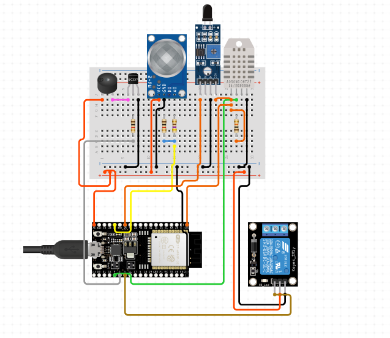

# Automated_Fire_Detection_and_suppression-_System
An innovative fire detection and suppression system combining multi-sensor fusion and IoT integration for accurate detection, real-time alerts, and automated suppression. Designed for residential, commercial, and industrial safety, it offers cost-effectiveness, scalability, and energy efficiency.

## **Circuit Diagram**
Include an image of the circuit design here. 

## Problem Statement
### Fire Hazards in Various Spaces
- Fires can result from electrical faults, gas leaks, human negligence, or natural disasters.
- Early detection is critical to prevent extensive damage to life and property.

## Technologies Used
- Microcontroller: ESP32 (Dual-core processing, built-in Wi-Fi and Bluetooth).
- Sensors:
  - DHT22: Temperature and humidity.
  - MQ-2: Smoke and combustible gas detection.
  - Flame Sensor: Infrared-based flame detection.
- IoT Protocols: MQTT or Firebase for real-time communication.
- Relay Module: Controls suppression systems (e.g., water pump).
- Power Supply: 5V DC adapter with voltage regulators.

## **Features
1. Multi-Sensor Fusion: Reduces false positives by cross-verifying data from multiple sensors.
2. Real-Time Monitoring: Sends notifications to mobile apps or dashboards.
3. Automated Suppression: Activates sprinklers or pumps immediately upon fire detection.
4. Customizable Thresholds: Tailored for residential, commercial, or industrial environments.
5. Energy-Efficient Design: Low-power standby mode.
6. Error Handling:** Alerts users if sensors malfunction or disconnect.

## Installation and Setup
1. Hardware Setup:
   - Connect components as per the circuit diagram.
   - Ensure power supply is stable.
2. Software Setup:
   - Install the Arduino IDE.
   - Add ESP32 libraries and configure the code.
   - Upload the code to ESP32.
3. IoT Configuration:
   - Set up an MQTT broker or Firebase for notifications.
   - Configure Wi-Fi credentials in the code.
4. Testing:
   - Simulate fire conditions to verify system responses.

